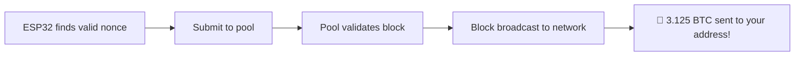

ESP32 Lottery Miner v3.1

<div align="center">https://img.shields.io/badge/ESP32-Lottery%20Miner-blue?style=for-the-badge&logo=espressif
https://img.shields.io/badge/version-3.1-green?style=for-the-badge
https://img.shields.io/badge/license-MIT-orange?style=for-the-badge
https://img.shields.io/badge/platform-ESP32-red?style=for-the-badge

A "lottery" Bitcoin miner that turns your ESP32 into a 24/7 lottery ticket machine

Features • Quick Start • Dashboard • Performance • FAQ

</div>

⚠️ Disclaimer

<div align="center">🎲 THIS IS A LOTTERY MINER 🎲
This project is for educational and entertainment purposes only
Probability of mining a block: ~1 in 10,000,000 per day
Expected time to find a block: ~3,500 years
Do not expect to make money - Expect to have fun!

</div>

📋 Features

<table>
<tr>
<td width="50%">🔥 Core Features

· ⛏️ Dual-Core SHA-256 Mining
· 🔒 TLS/SSL Support (WSS port 4333)
· 🔄 Auto Pool Failover (4 backup pools)
· 🛡️ Watchdog Timer (30s auto-reset)
· 💾 Persistent Config (NVS storage)

</td>
<td width="50%">🌐 Connectivity

· ⚙️ WiFi Manager (AP mode setup)
· 📡 mDNS Support (esp-miner.local)
· 📦 OTA Updates (no USB needed)
· 🎛️ Real-time Web Dashboard
· 📊 Live Hashrate Monitoring

</td>
</tr>
</table>

🔧 Hardware Requirements

<div align="center">Component Specification Notes
MCU ESP32 (any variant) DevKit, NodeMCU-32S, TTGO
Power 5V / 1A minimum Stable power recommended
Cooling Passive (optional) ESP32 runs cool at this load
Network 2.4 GHz WiFi 5 GHz not supported

</div>

📚 Required Libraries

<details>
<summary><b>Click to expand library list</b></summary>Library Author Version Purpose
WiFiManager tzapu ≥2.0.0 WiFi configuration via AP
WebSocketsClient Markus Sattler ≥2.4.0 Stratum WebSocket connection
ArduinoJson Benoit Blanchon ≥6.21.0 JSON parsing from pool
ESPAsyncWebServer me-no-dev ≥2.0.0 Async web server
AsyncTCP me-no-dev ≥2.0.0 Async TCP for ESP32
AsyncElegantOTA Ayush Sharma ≥2.0.0 Over-the-air updates

Install via Arduino Library Manager or PlatformIO.

</details>---

🚀 Quick Start

1️⃣ Clone Repository

```bash
git clone https://github.com/nam348tnh3gp/ESP32-Lottery.git
cd esp32-lottery-miner
```

2️⃣ Open in Arduino IDE

· Open ESP_Code.ino
· Ensure DSHA2.h is in the same folder
· Select board: ESP32 Dev Module

3️⃣ Upload to ESP32

· Connect ESP32 via USB
· Select COM port
· Click Upload 🚀

4️⃣ First Run - WiFi Setup

Step Action
1 ESP32 creates AP ESP32-Miner-Setup
2 Connect to this WiFi (no password)
3 Open 192.168.4.1 in browser
4 Enter home WiFi credentials
5 Save → ESP32 reboots

5️⃣ Configure Miner

Step Action
1 Find ESP32 IP from Serial Monitor
2 Open browser to that IP
3 Click ⚙️ Configure
4 Enter BTC Address & Worker Name
5 Save → Mining starts!

---

🖥️ Web Dashboard

<div align="center">Metric Description
Status 🟢 Mining / 🟡 Waiting / 🔴 Disconnected
Total Hashrate Combined H/s from both cores
Core 0/1 Individual core performance
Nonce Range Current search space
Active Pool With TLS/TCP badge
Backup Pools Failover list with status

</div>Control Panel

Button Action
⚙️ Configure Open settings panel
🔄 Switch Pool Manual failover
🔁 Restart Reboot ESP32
📡 Reset WiFi Clear saved WiFi
📦 OTA Update Upload new firmware

---

🔌 Pool Configuration

Connection Types

Type Port Protocol Badge
TCP 3333 WS 🔓 TCP
TLS 4333 WSS 🔒 TLS

Stratum Credentials

```
URL:      stratum+tcp://public-pool.io:3333
Username: <BTC_ADDRESS>.<WORKER_NAME>
Password: x
```

Backup Pools (Auto Failover)

# Pool Port Type
1 public-pool.io 3333 TCP
2 public-pool.io 4333 TLS
3 pool.vkbit.com 3333 TCP
4 stratum.slushpool.com 3333 TCP

---

⚡ Performance

<div align="center">Metric Value
Single Core ~50-100 kH/s
Dual Core ~100-200 kH/s
RAM Usage ~50 KB
Stack/Task 10 KB
Flash Used ~1.5 MB

</div>Hashrate Comparison

```
ESP32 (this miner):     ████                    ~0.0002 MH/s
USB Block Erupter:      ████████████            ~333 MH/s
Antminer S19:           ████████████████████████ ~110,000,000 MH/s
```

---

📁 Project Structure

```
📦 esp32-lottery-miner
├── 📄 ESP_Code.ino           # Main firmware (v3.1)
├── 📄 DSHA2.h                # SHA-256 implementation
├── 📄 README.md              # This documentation
```

DSHA2.h - SHA-256 Implementation

```cpp
// Optimized for ESP32 with:
✅ GCC intrinsics (__builtin_bswap32, __builtin_rotateright32)
✅ Fallback for older compilers
✅ Double SHA-256 for Bitcoin headers
✅ Alignment-safe memory access
✅ Inline functions for maximum performance
```

---

🎯 Lottery Mining - The Reality

<div align="center">Parameter Value
🌐 Network Hashrate ~855 EH/s
💻 ESP32 Hashrate ~0.0002 MH/s
⏱️ Block Time ~10 minutes
💰 Block Reward 3.125 BTC
🎲 Daily Probability ~1 in 10,000,000
📅 Expected Time ~3,500 years

</div>What If You Win?



---

🔧 Troubleshooting

<details>
<summary><b>❌ ESP32 won't connect to WiFi</b></summary>· Verify 2.4 GHz network (ESP32 doesn't support 5 GHz)
· Check credentials in AP mode (192.168.4.1)
· Move ESP32 closer to router
· Try manual configuration via Serial

</details><details>
<summary><b>❌ Pool connection fails</b></summary>· Verify pool host and port
· Try switching TCP ↔ TLS
· Check BTC address format
· Monitor Serial for detailed errors
· Try manual pool switch via dashboard

</details><details>
<summary><b>❌ Low hashrate</b></summary>· WiFi.setSleep(false) is already set
· Increase CPU to 240 MHz in board settings
· Close other network clients
· Check for thermal throttling

</details><details>
<summary><b>❌ ESP32 crashes/reboots</b></summary>· Ensure stable 5V/1A power
· Watchdog auto-resets after 30s
· Check Serial for stack overflow
· Try reducing stack size if needed

</details>---

📊 Serial Monitor Output

```
╔══════════════════════════════════════════════════════════════╗
║           🎰 ESP32 Lottery Miner v3.1 Starting...           ║
╚══════════════════════════════════════════════════════════════╝

📋 Loaded config - Pool: public-pool.io:3333 (TCP)
💳 BTC Address: 1A1zP1eP5QGefi2DMPTfTL5SLmv7DivfNa
👤 Worker: 1A1zP1eP5QGefi2DMPTfTL5SLmv7DivfNa.ESP32

╔══════════════════════════════════════════════════════════════╗
║                      ✅ WiFi connected!                      ║
║                   🌐 IP Address: 192.168.1.100               ║
║                     📶 RSSI: -45 dBm                         ║
╚══════════════════════════════════════════════════════════════╝

🔧 Dashboard:    http://192.168.1.100
📦 OTA Update:   http://192.168.1.100/update
📡 mDNS:         http://esp-miner.local

⚡ Dual-core mining enabled (Stack: 10KB)
🔄 Auto pool failover: ENABLED (4 pools)
🔒 TLS Support: ENABLED (port 4333)
🛡️ Watchdog: 30s

╔══════════════════════════════════════════════════════════════╗
║                       🔌 Connecting...                       ║
╚══════════════════════════════════════════════════════════════╝

🔌 Connecting to public-pool.io:3333 (WS)...
✅ Connected to pool: public-pool.io:3333
📡 Subscribing as: ESP32/3.1
🔑 Authorizing as: 1A1zP1eP5QGefi2DMPTfTL5SLmv7DivfNa.ESP32
🔑 Authorized on public-pool.io
📦 New job #abc123 from public-pool.io

╔══════════════════════════════════════════════════════════════╗
║                      ⛏️  MINING ACTIVE  ⛏️                    ║
╚══════════════════════════════════════════════════════════════╝

⚡ 156.32 H/s (C0: 78.12, C1: 78.20) | Range: 0x00000000 | Pool: public-pool.io:3333
⚡ 158.45 H/s (C0: 79.23, C1: 79.22) | Range: 0x10000000 | Pool: public-pool.io:3333
⚡ 155.89 H/s (C0: 77.95, C1: 77.94) | Range: 0x20000000 | Pool: public-pool.io:3333
```

---

🏆 What If You Actually Find a Block?

<div align="center">If this happens... Then...
🏆 BLOCK FOUND by Core 0! Serial Monitor shows this
🎯 SUBMITTED NONCE: 0xXXXXXXXX Nonce sent to pool
✅ Share accepted by pool Pool validates your block
Bitcoin Network Confirms 🎉 YOU WIN 3.125 BTC! 🎉

Then you...

1. 📸 Take a screenshot
2. 🐦 Post it on Twitter/X
3. 🏝️ Quit your job (optional)
4. 🍾 Buy everyone a drink

</div>---

🔗 API Reference

<details>
<summary><b>REST API Endpoints</b></summary>Endpoint Method Description
/api/stats GET Get current mining statistics
/api/config POST Update miner configuration
/api/switchpool GET Manually switch to next pool
/api/restart GET Restart ESP32
/api/resetwifi GET Clear WiFi settings

Example Response (/api/stats)

```json
{
  "status": "🟢 Mining",
  "hashrate": "156.32",
  "hashrate0": "78.12",
  "hashrate1": "78.20",
  "totalHashes": "1234567",
  "nonceStart": "0x00000000",
  "nonceEnd": "0x7FFFFFFF",
  "pool": "public-pool.io:3333 🔓 TCP",
  "btcAddress": "1A1zP1eP5QGefi2DMPTfTL5SLmv7DivfNa",
  "worker": "1A1zP1eP5QGefi2DMPTfTL5SLmv7DivfNa.ESP32",
  "ip": "192.168.1.100",
  "version": "3.1"
}
```

</details>---

🎮 Fun Ideas & Extensions

<div align="center">Idea Difficulty Cool Factor
📺 OLED Display with QR Code 🔴 Hard 🤩🤩🤩
📱 Telegram Notifications 🟡 Medium 🤩🤩
🌈 RGB LED Status 🟢 Easy 🤩
📊 Grafana Dashboard 🟡 Medium 🤩🤩🤩
🔋 Battery Powered 🟢 Easy 🤩🤩
📈 Mining Stats Logger 🟡 Medium 🤩🤩
🌐 Multi-Pool Strategy 🔴 Hard 🤩🤩🤩
🤖 Discord Bot Integration 🟡 Medium 🤩🤩

</div>---

📝 License

<div align="center">```
MIT License

Copyright (c) 2024 ESP32 Lottery Miner Contributors

Permission is hereby granted, free of charge, to any person obtaining a copy
of this software and associated documentation files (the "Software"), to deal
in the Software without restriction, including without limitation the rights
to use, copy, modify, merge, publish, distribute, sublicense, and/or sell
copies of the Software, and to permit persons to whom the Software is
furnished to do so, subject to the following conditions:

The above copyright notice and this permission notice shall be included in all
copies or substantial portions of the Software.

THE SOFTWARE IS PROVIDED "AS IS", WITHOUT WARRANTY OF ANY KIND, EXPRESS OR
IMPLIED, INCLUDING BUT NOT LIMITED TO THE WARRANTIES OF MERCHANTABILITY,
FITNESS FOR A PARTICULAR PURPOSE AND NONINFRINGEMENT. IN NO EVENT SHALL THE
AUTHORS OR COPYRIGHT HOLDERS BE LIABLE FOR ANY CLAIM, DAMAGES OR OTHER
LIABILITY, WHETHER IN AN ACTION OF CONTRACT, TORT OR OTHERWISE, ARISING FROM,
OUT OF OR IN CONNECTION WITH THE SOFTWARE OR THE USE OR OTHER DEALINGS IN THE
SOFTWARE.
```

</div>---

🙏 Acknowledgments

<div align="center">Project Thanks for...
Bitcoin The original cryptocurrency
ESP32 Community Amazing documentation & support
public-pool.io Open-source solo mining pool
Stratum Protocol Standardized mining protocol
Arduino Making embedded development accessible

</div>---

🌟 Star History

<div align="center">https://api.star-history.com/svg?repos=nam348tnh3gp/ESP32-Lottery&type=Date

</div>---

📞 Support & Community

<div align="center">Channel Link
🐛 Issues GitHub Issues
💬 Discussions GitHub Discussions
📧 Email nam348tnh2@gmail.com

</div>---

⭐ Contributing

<div align="center">Contributions are welcome! Here's how:

1. 🍴 Fork the repository
2. 🌿 Create a feature branch (git checkout -b feature/amazing-feature)
3. 💾 Commit your changes (git commit -m 'Add amazing feature')
4. 📤 Push to branch (git push origin feature/amazing-feature)
5. 🔄 Open a Pull Request

</div>---

<div align="center">🍀 Good luck, and happy (lottery) mining! 🍀

May the nonce be with you!

⬆️ Back to Top

</div>
