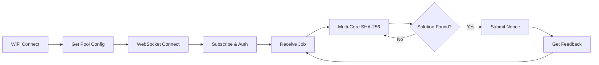

🎰 ESP32/ESP8266 Lottery Miner v1.3

[](https://opensource.org/licenses/MIT)
[](https://isocpp.org/)
[](https://www.espressif.com/en/products/socs)
[](https://platformio.org/)
[](https://www.arduino.cc/en/software)

A "lottery" Bitcoin miner that turns your ESP32/ESP8266 into a 24/7 lottery ticket machine.  
Supports **ESP32, ESP32‑S2, ESP32‑C3, ESP32‑S3, ESP32‑C6(coming soo), ESP8266** with automatic core detection, WiFi Manager, Web Dashboard, and Auto Pool Failover.

---

## ✨ Features

| Feature | Description |
|---------|-------------|
| ⛏️ **Dual-Core Mining** | Auto‑detects CPU cores – uses both cores on dual‑core chips, single‑core loop on others |
| 🔒 **TLS/SSL Support** | Supports encrypted WSS (port 4333) and plain WS (port 3333) |
| 🔄 **Auto Pool Failover** | Automatically switches to backup pools on connection loss (4 pools) |
| 🎛️ **Web Dashboard** | Real‑time web interface showing hashrate, nonce, and status |
| ⚙️ **WiFi Manager** | Auto‑launches AP `ESP‑Miner‑Setup` (192.168.4.1) for WiFi configuration |
| 📡 **mDNS Support** | Access dashboard via `http://esp-miner.local` |
| 🛡️ **Watchdog Timer** | Auto‑reset if system hangs for more than 30 seconds |
| 💾 **Persistent Config** | Saves configuration to Preferences (ESP32) or EEPROM (ESP8266) |
| 📊 **Real‑time Stats** | Live hashrate and pool status display |
| 🧠 **Auto Core Detection** | Detects chip type and core count – no manual configuration needed |
| 🪶 **Multi‑Platform** | Compiles for ESP8266, ESP32, ESP32‑S2, ESP32‑C3, ESP32‑S3, ESP32‑C6 |

---

## 📋 Supported Hardware

| Chip | Cores | Auto‑Detect | Notes |
|------|-------|-------------|-------|
| ESP32 | 2 | ✅ | Standard dual‑core, full features |
| ESP32‑S3 | 2 | ✅ | Dual‑core with USB CDC |
| ESP32‑S2 | 1 | ✅ | Single‑core, USB CDC |
| ESP32‑C3 | 1 | ✅ | Single‑core RISC‑V |
| ESP32‑C6 | 1 | ✅ | Single‑core RISC‑V |
| ESP8266 | 1 | ✅ | Single‑core, no FreeRTOS, lite dashboard |

---

## 📦 Required Libraries

### PlatformIO (recommended)
All libraries are automatically installed via `platformio.ini`.

### Arduino IDE
Install via **Arduino Library Manager**:

| Library | Author |
|---------|--------|
| WiFiManager | tzapu |
| WebSockets | Markus Sattler |
| ArduinoJson | Benoit Blanchon |
| ESPAsyncWebServer | me‑no‑dev |
| AsyncTCP | me‑no‑dev |
| Time | Paul Stoffregen |
| NTPClient | Arduino Libraries |

For **ESP8266**, also install:

| Library | Author |
|---------|--------|
| ESPAsyncTCP | me‑no‑dev |

---

## 🚀 Quick Start

### 1. Clone the Repository
```bash
git clone https://github.com/nam348tnh3gp/ESP32-Lottery.git
cd ESP32-Lottery
```

2. Configure the Miner

Default settings (can be changed via Web Dashboard):

```ini
pool_host=public-pool.io
pool_port=3333
btc_address=YourBitcoinAddress
worker_name=ESP32
```

Configuration Options

Option Description Example
pool_host Stratum pool hostname public-pool.io
pool_port Pool port (3333=TCP, 4333=TLS) 3333
btc_address Your Bitcoin address 1A1zP1eP5QGefi2DMPTfTL5SLmv7DivfNa
worker_name Name for your mining rig ESP32

3. Build & Upload

PlatformIO

```bash
# Build for ESP32
pio run -e esp32dev

# Build for ESP32‑S2
pio run -e esp32-s2

# Build for ESP32‑S3
pio run -e esp32-s3

# Build for ESP32‑C3
pio run -e esp32-c3

# Build for ESP8266
pio run -e esp8266

# Upload to connected board
pio run -e esp32dev -t upload
```

Arduino IDE

· Open ESP_Code.ino
· Select your board in Tools → Board
· Click Upload

4. First Run – WiFi Setup

· ESP creates AP ESP-Miner-Setup
· Connect to this WiFi (no password)
· Open 192.168.4.1 in browser
· Enter home WiFi credentials and save

5. Start Mining

· ESP reboots and connects to WiFi
· Access dashboard at http://esp-miner.local or ESP's IP address
· Configure BTC address via the Web Dashboard
· Mining begins automatically!

---

📊 Performance Examples

Device Cores Algorithm Approx. Hashrate
ESP32‑WROOM‑32 2 SHA‑256 ~150 kH/s
ESP32‑S3 2 SHA‑256 ~200 kH/s
ESP32‑S2 1 SHA‑256 ~50 kH/s
ESP32‑C3 1 SHA‑256 ~40 kH/s
ESP8266 1 SHA‑256 ~15 kH/s

---

📁 Project Structure

```
ESP32-Lottery/
├── ESP_Code.ino          # Main miner implementation
├── DSHA2.h               # SHA‑256 algorithm (header‑only)
├── README.md             # This file
├── platformio.ini        # PlatformIO build configuration
└── LICENSE               # MIT License
```

---

🔧 Troubleshooting

<details>
<summary><b>🔌 Connection Issues</b></summary>· Test pool connectivity: ping public-pool.io
· Check internet connection
· Verify WiFi credentials in AP mode (192.168.4.1)
· Try switching between TCP (3333) and TLS (4333)
· If using ESP32‑S2/C3, ensure ‑D Serial=Serial0 is in build_flags

</details><details>
<summary><b>📛 Compilation Errors</b></summary>· ESP32‑S2/C3 'Serial' was not declared: Add -D Serial=Serial0 to build_flags in platformio.ini
· ESP32‑S3 conflicting declaration 'Serial0': Remove -D Serial=Serial0 from S3 environment
· ESP8266 FreeRTOS errors: The code auto‑detects ESP8266 and disables FreeRTOS; no action needed
· Verify all libraries are installed
· Ensure DSHA2.h is in the same folder as the .ino file

</details><details>
<summary><b>🐌 Low Hashrate</b></summary>· WiFi.setSleep(false) is already set in code
· Increase CPU frequency to 240 MHz (ESP32) or 160 MHz (ESP8266) in board settings
· Close other network clients
· Check for thermal throttling

</details><details>
<summary><b>💥 ESP crashes/reboots</b></summary>· Ensure stable 5 V/1 A power supply
· Watchdog auto‑resets after 30 seconds
· Check Serial Monitor for stack overflow errors

</details>---

📝 How It Works



1. WiFi Connect – Connects to saved WiFi or launches AP for configuration
2. Get Pool Config – Loads pool settings from Preferences (ESP32) or EEPROM (ESP8266)
3. WebSocket Connect – Establishes WebSocket connection to Stratum pool
4. Subscribe & Auth – Authenticates with <BTC_ADDRESS>.<WORKER> format
5. Receive Job – Gets block header and target from pool
6. Multi‑Core SHA‑256 – All available cores search nonce space in parallel (single‑core loop on ESP8266)
7. Submit Solution – Sends valid nonce back to pool if found
8. Repeat – Continuous mining loop with auto‑failover

---

🤝 Contributing

Contributions are welcome! Here's how you can help:

1. 🍴 Fork the repository
2. 🌿 Create your feature branch (git checkout -b feature/AmazingFeature)
3. 💾 Commit your changes (git commit -m 'Add some AmazingFeature')
4. 📤 Push to the branch (git push origin feature/AmazingFeature)
5. 🔍 Open a Pull Request

---

📄 License

This project is licensed under the MIT License – see the LICENSE file for details.

```
MIT License

Copyright (c) 2025 ESP32 Lottery Miner Contributors

Permission is hereby granted, free of charge, to any person obtaining a copy
of this software and associated documentation files (the "Software"), to deal
in the Software without restriction, including without limitation the rights
to use, copy, modify, merge, publish, distribute, sublicense, and/or sell
copies of the Software, and to permit persons to whom the Software is
furnished to do so, subject to the following conditions:

The above copyright notice and this permission notice shall be included in all
copies or substantial portions of the Software.

THE SOFTWARE IS PROVIDED "AS IS", WITHOUT WARRANTY OF ANY KIND, EXPRESS OR
IMPLIED, INCLUDING BUT NOT LIMITED TO THE WARRANTIES OF MERCHANTABILITY,
FITNESS FOR A PARTICULAR PURPOSE AND NONINFRINGEMENT. IN NO EVENT SHALL THE
AUTHORS OR COPYRIGHT HOLDERS BE LIABLE FOR ANY CLAIM, DAMAGES OR OTHER
LIABILITY, WHETHER IN AN ACTION OF CONTRACT, TORT OR OTHERWISE, ARISING FROM,
OUT OF OR IN CONNECTION WITH THE SOFTWARE OR THE USE OR OTHER DEALINGS IN THE
SOFTWARE.
```

---

👀 Acknowledgments

· Bitcoin – The original cryptocurrency
· DSHA2 Implementation – SHA‑256 algorithm in C++ for ESP32/ESP8266
· ESP32/ESP8266 Community – For extensive documentation and libraries
· public-pool.io – Open‑source solo mining pool
· Stratum Protocol – Standardized mining protocol

---

📧 Contact & Support

· 🐛 Issues: GitHub Issues
· 💬 Discussions: GitHub Discussions

---

<div align="center">⭐ Star this repository if you find it useful!

Report Bug · Request Feature

---

🍀 Good luck, and happy (lottery) mining! 🍀

May the nonce be with you!

</div>
